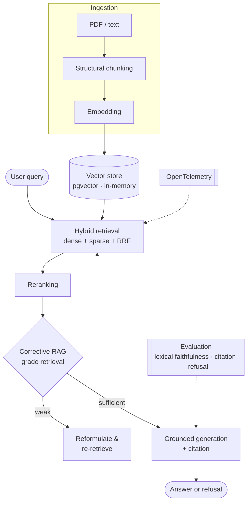

# LexRAG

**English** · [Português](README.pt-BR.md)

> Legal-document assistant in .NET 8 for the Brazilian legal sector. Hybrid retrieval, answers grounded in traceable citations, and a corrective loop that knows when to search again and when to say it doesn't know.

[](https://github.com/torwi-tech/lexrag-dotnet/actions/workflows/ci.yml)


LexRAG answers questions over a Brazilian legal corpus (STF/STJ súmulas, binding precedents, court decisions) and ingests legal PDFs and plain text. It retrieves with hybrid search and reranking, grounds each answer in a citation you can trace to the source, and refuses when the corpus doesn't back the question. It runs on .NET 8 with Semantic Kernel and pgvector.

This is a proof-of-concept. The domain and regulatory framing (CNJ Res. 615/2025, LGPD) are specific to the Brazilian judiciary; [ADR 0012](Docs/adr/0012-regulatory-conformance-mapping.md) maps them without claiming conformance the PoC does not have. Known trade-offs are documented in [LIMITATIONS.md](LIMITATIONS.md).

## Table of contents

- [Why grounding matters](#why-grounding-matters)
- [Highlights](#highlights)
- [Architecture](#architecture)
- [Tech stack](#tech-stack)
- [Getting started](#getting-started)
- [Project structure](#project-structure)
- [What is real vs. faked](#what-is-real-vs-faked)
- [Testing](#testing)
- [Architecture decisions](#architecture-decisions)
- [Documentation](#documentation)
- [Scope and limitations](#scope-and-limitations)
- [Design notes](#design-notes)
- [Related project](#related-project)
- [References](#references)

## Why grounding matters

Even mature legal-research tools still hallucinate in the 17–33% range when they run on RAG.[^hallucination] Retrieval constrains hallucination but does not remove it. In a legal setting that residual gap carries compliance weight, since Brazil's CNJ Resolution 615 sets expectations for citation and human oversight of AI in the judiciary. LexRAG handles it by grounding every answer in the passages it actually retrieved, attaching a citation, and refusing when nothing in the corpus backs the question.

## Highlights

- Refusal over improvisation: when nothing in the corpus backs a question, the system refuses before it calls the model. Grounding is a structural property, not a line in a prompt.
- Honest evaluation: a deterministic gate (lexical-faithfulness, citation, refusal) runs in CI, an LLM-judge layer covers semantic faithfulness off CI, and retrieval metrics (Recall@K, Hit-rate@K, MRR) run over a golden set. The judge variance and the inert score gate are documented in [LIMITATIONS.md](LIMITATIONS.md).
- Hexagonal architecture: the domain core has no external dependencies, and an architecture test keeps it that way.
- Grounded answers with citations (`[Fonte: doc, trecho N]`) you can trace back to the passage that was retrieved.
- Hybrid retrieval: a dense cosine leg and a sparse lexical leg (BM25 in-memory; PostgreSQL `ts_rank` on pgvector), fused with Reciprocal Rank Fusion, then reranked.
- Corrective RAG: the pipeline grades its own retrieval and, when the context looks weak, reformulates the query and searches again. The loop is bounded and shows up in the trace.
- Runs offline: a hash embedder, an extractive chat client, and an in-memory store let the whole suite run with no key and no Docker.
- OpenTelemetry tracing across the pipeline (a custom `LexRag.Rag` ActivitySource), with HTTP and ASP.NET metrics and trace-correlated logs.

## Architecture



The domain core depends on nothing external, and an architecture test enforces that. Every call to an LLM, embedder, or vector store goes through a port with a deterministic in-process fake, which is what makes the offline build work. Corrective RAG is plain code rather than a model-driven agent loop, so each decision is recorded in the answer trace.

## Tech stack

| Concern | Choice |
|---|---|
| Language / runtime | .NET 8 (C# 12) |
| Orchestration | Microsoft.SemanticKernel + Microsoft.Extensions.AI |
| Vector store | pgvector via raw Npgsql + Pgvector; in-memory fallback |
| Retrieval | dense cosine + sparse lexical (BM25 in-memory; `ts_rank` on pgvector), fused with RRF |
| Reranking | cross-encoder concept; keyless lexical-coverage stand-in |
| Evaluation | lexical faithfulness / citation / refusal + LLM-judge (M.E.AI.Evaluation, semantic) + Recall@K, Hit-rate@K, MRR |
| Observability | OpenTelemetry (pipeline tracing, HTTP/ASP.NET metrics, correlated logs) |
| Hosting | ASP.NET Core Minimal API |
| Ingestion | PdfPig |
| Testing | xUnit, FsCheck, NetArchTest, Testcontainers |

Built with the .NET 10 SDK, targeting `net8.0`.

## Getting started

You need the .NET 8 SDK (the .NET 10 SDK works too, since the project targets `net8.0`).

### With Azure OpenAI and pgvector

Full provisioning walkthrough in [`Docs/azure-setup.md`](Docs/azure-setup.md). No code changes — the real providers drop in through configuration:

```bash
# Start pgvector
docker compose up -d

# Configure Azure OpenAI (user-secrets)
cd src/LexRag.Api
dotnet user-secrets set "AzureOpenAI:Endpoint" "https://<resource>.openai.azure.com/"
dotnet user-secrets set "AzureOpenAI:Key" "<key>"
dotnet user-secrets set "ConnectionStrings:Postgres" \
  "Host=localhost;Port=5432;Database=lexrag;Username=lexrag;Password=lexrag"
```

### Without external services

The default providers are deterministic fakes — a hash embedder (FNV-1a) and an extractive chat client — so the build and the whole test suite run with no API key and no Docker.

```bash
dotnet run --project src/LexRag.Api
#   -> http://localhost:5007, sample corpus already indexed
```

`GET /health` reports the active mode (`hash-fake` or `AzureOpenAI`; `in-memory` or `pgvector`).

### Endpoints

```bash
# Ask a question grounded in the corpus (answer + citation)
curl -s localhost:5007/ask -H "Content-Type: application/json" \
  -d '{"query":"Qual o termo inicial da prescricao intercorrente na execucao fiscal?"}'

# A question outside the corpus -> refusal (anti-hallucination)
curl -s localhost:5007/ask -H "Content-Type: application/json" \
  -d '{"query":"Qual a capital da Australia?"}'   # -> "Nao encontrei nos documentos fornecidos."

# Corrective RAG: grades retrieval and re-queries if it's weak; `trace` shows the steps
curl -s localhost:5007/ask/crag -H "Content-Type: application/json" \
  -d '{"query":"gostaria de saber sobre a prescricao intercorrente na execucao fiscal"}'

# Evaluation harness (lexical faithfulness / citation / refusal)
curl -s -X POST localhost:5007/eval

# One-command retrieval eval (prints Recall@K / Hit-rate@K / MRR, then stops the API)
bash scripts/eval-reproduce.sh
# or on Windows: pwsh scripts/eval-reproduce.ps1

# Tests (unit, theory, property-based, architecture, integration, e2e)
dotnet test
```

By default the eval script runs against the committed curated corpus (always present). If `data/juristcu/` exists (see [`Docs/eval-datasets.md`](Docs/eval-datasets.md) for the fetch commands), it switches to the full 150-query JurisTCU set automatically.

## Project structure

```
src/
  Core           pure domain: chunking, RRF, BM25, grounding, citation
  Ingestion      PdfPig + plain text
  Embeddings     hash fake + Azure OpenAI
  Index          in-memory + pgvector (raw SQL)
  Retrieval      hybrid + RRF + reranking
  Orchestration  Semantic Kernel: explicit pipeline + agentic plugin
  Eval           lexical faithfulness / citation / refusal + retrieval metrics
  Api            Minimal API
tests/           xUnit: unit, theory, property-based, architecture, integration, e2e
Docs/            requirements.md, architecture.md, adr/
```

## What is real vs. faked

Real: the retrieval pipeline (chunking, dense similarity, sparse lexical retrieval, RRF fusion, reranking), grounding and citation, the refusal path, Corrective RAG, the evaluation harness with its retrieval metrics, and the OpenTelemetry wiring.

Faked, behind ports: the embedder (`HashEmbedder`, FNV-1a) and the chat model (`ToolCallingExtractiveChatClient`, extractive) are deterministic and keyless, so the Azure OpenAI clients replace them through config without touching code. The agentic path (`/ask/agentic`) also works offline: `SemanticKernelRagService` wraps a Semantic Kernel plugin as an `AIFunction` and drives the tool loop via `Microsoft.Extensions.AI` function-invocation middleware, which fires regardless of which chat client is wired. The pgvector path itself is real, covered by a Testcontainers test that skips when Docker isn't available.

## Testing

Six xUnit styles: unit, `Theory`, property-based (FsCheck), architecture (NetArchTest, which enforces the core's dependency rule), integration (Testcontainers with real pgvector), and end-to-end (`WebApplicationFactory`). The pgvector test skips cleanly when there's no Docker.

## Architecture decisions

The decisions live as ADRs in [`Docs/adr/`](Docs/adr/). Each one follows Context, Decision, Consequences, Alternatives, and ends with the conditions that would make us revisit it.

| # | Decision |
|---|---|
| [0001](Docs/adr/0001-vector-store-port-and-pgvector.md) | Vector store behind a port; pgvector via raw SQL is the default adapter |
| [0002](Docs/adr/0002-cosine-distance.md) | Cosine distance for legal text |
| [0003](Docs/adr/0003-hnsw-index.md) | HNSW index (m=16, ef_construction=128) over IVFFlat |
| [0004](Docs/adr/0004-hybrid-retrieval-rrf.md) | Hybrid retrieval (dense + sparse lexical) fused with RRF |
| [0005](Docs/adr/0005-structural-chunking.md) | Sentence-packing chunking with overlap |
| [0006](Docs/adr/0006-grounding-anti-hallucination.md) | Structural grounding + citation + refusal |
| [0007](Docs/adr/0007-confidentiality-data-boundary.md) | Confidentiality / data boundary |
| [0008](Docs/adr/0008-keyless-deterministic-fakes.md) | Deterministic fakes so the build and tests need no key or Docker |
| [0009](Docs/adr/0009-corrective-rag.md) | Corrective RAG (CRAG) as an explicit, opt-in pipeline |
| [0010](Docs/adr/0010-lgpd-data-boundary.md) | LGPD: data boundary for LLM calls and telemetry |
| [0011](Docs/adr/0011-eval-three-way-strategy.md) | Three-way evaluation: deterministic gate (CI) + LLM-judge (run, key-gated, off CI) + managed benchmark (specced) |
| [0012](Docs/adr/0012-regulatory-conformance-mapping.md) | Regulatory conformance mapping (CNJ Res. 615/2025 + LGPD) |

## Documentation

- [`Docs/requirements.md`](Docs/requirements.md) — functional and non-functional requirements.
- [`Docs/architecture.md`](Docs/architecture.md) — layers, known limitations, and escalation paths.
- [`Docs/adr/`](Docs/adr/) — the architecture decision records above.
- [`Docs/eval-datasets.md`](Docs/eval-datasets.md) — evaluation datasets and dimension benchmarks, what's ingested, what's referenced, and the Brazilian-Portuguese gap.
- [`Docs/observability.md`](Docs/observability.md) — spans emitted, metrics, how to view traces locally (console exporter) and forward to an OTLP backend.
- [`Docs/sample-trace.txt`](Docs/sample-trace.txt) — real OTel console-exporter output from a `POST /ask` request.
- [`Docs/azure-setup.md`](Docs/azure-setup.md) — provisioning real Azure OpenAI: resource, model deployment, and user-secrets.
- [`LIMITATIONS.md`](LIMITATIONS.md) — what this proof-of-concept does not do yet and how each gap closes.
- [`Docs/golden-set-datasheet.md`](Docs/golden-set-datasheet.md) — the two evaluation golden sets: size, in/out-domain, qrels, single vs. multi-hop, and limits.

## Scope and limitations

This is a proof-of-concept, not a system tuned for production scale. The hash embedder is a lexical proxy rather than a semantic model, and the reranker and the CRAG grader are heuristic stand-ins for the LLM-backed versions that fit behind the same ports. The ADRs and `architecture.md` spell out each limitation and how you'd get past it.

## Design notes

One constraint shaped most of the architecture: the system had to build, test, and run with no API key and no Docker. Every model call and store sits behind a port because the offline fake and the Azure provider have to be interchangeable at DI registration time — the hexagonal boundary follows directly from that. Fakes live outside the core, and an architecture test keeps it that way.

The evaluation was written to surface its own limits rather than pick a flattering number. The LLM-judge variance is reported (84% ± 0 pp over 5 runs, with a note on why the spread is zero). `MinRelevanceScore` is implemented and tested, sitting at `0.0` until calibrated against a real Azure run — an inactive gate is more honest than a threshold without data behind it.

What stays open: the hash embedder is lexical, so the semantic recall numbers are only meaningful after that run. The perturbation harness covers surface-form variants today; semantic paraphrases and adversarial distractors are the next step and both require LLM-generated cases. Neither touches a port.

## Related project

This is one of a pair. [`agentic-workflow-dotnet`](https://github.com/torwi-tech/agentic-workflow-dotnet) is the agent-orchestration companion: a supervised Research/Draft/Review workflow with a mandatory human gate before anything is emitted, and LexRAG is the natural retrieval source (`IPrecedentSource`) behind its research step. Both repos take the same approach to two different problems. The domain core has no external dependencies, every model sits behind a port with a deterministic keyless fake, the flow is explicit and auditable instead of a model-driven loop, answers carry `[Fonte: id]` citations, and both are framed around CNJ Resolution 615 for AI in the Brazilian judiciary.

## References

- [`NikiforovAll/typical-rag-dotnet`](https://github.com/NikiforovAll/typical-rag-dotnet) — Semantic Kernel + Kernel Memory + Aspire.
- [`Azure-Samples/postgres-semantic-kernel-examples`](https://github.com/Azure-Samples/postgres-semantic-kernel-examples) — Semantic Kernel + pgvector.

[^hallucination]: Magesh, Surani, Dahl, Suzgun, Manning, Ho. *Hallucination-Free? Assessing the Reliability of Leading AI Legal Research Tools.* Stanford HAI / RegLab, 2024.
