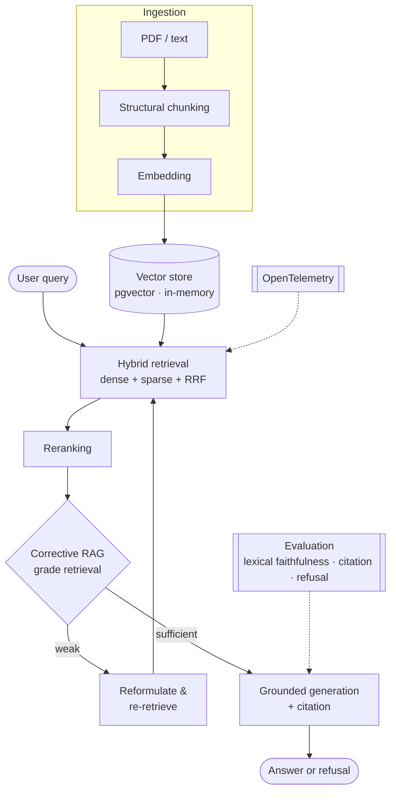

# LexRAG

[English](README.md) · **Português**

> Assistente de documentos jurídicos em .NET 8 para o setor jurídico brasileiro. Busca híbrida, respostas ancoradas em citações rastreáveis e um laço corretivo que sabe a hora de buscar de novo e a hora de dizer que não sabe.

[](https://github.com/torwi-tech/lexrag-dotnet/actions/workflows/ci.yml)


O LexRAG responde perguntas sobre um acervo jurídico brasileiro (súmulas, precedentes vinculantes e decisões do STF/STJ) e ingere PDFs e texto jurídico. Ele recupera com busca híbrida e reranking, ancora cada resposta numa citação que dá pra rastrear até a fonte, e recusa quando o acervo não sustenta a pergunta. Roda em .NET 8 com Semantic Kernel e pgvector.

É um proof-of-concept. O domínio e o enquadramento regulatório (Res. CNJ 615/2025, LGPD) são específicos do Judiciário brasileiro; o [ADR 0012](Docs/adr/0012-regulatory-conformance-mapping.md) mapeia esse enquadramento sem reivindicar uma conformidade que o PoC não tem. Os trade-offs conhecidos estão documentados no [LIMITATIONS.md](LIMITATIONS.md).

## Índice

- [Por que ancoragem importa](#por-que-ancoragem-importa)
- [Destaques](#destaques)
- [Arquitetura](#arquitetura)
- [Stack](#stack)
- [Começando](#começando)
- [Estrutura do projeto](#estrutura-do-projeto)
- [O que é real vs. fake](#o-que-é-real-vs-fake)
- [Testes](#testes)
- [Decisões de arquitetura](#decisões-de-arquitetura)
- [Documentação](#documentação)
- [Escopo e limitações](#escopo-e-limitações)
- [Notas de design](#notas-de-design)
- [Projeto irmão](#projeto-irmão)
- [Referências](#referências)

## Por que ancoragem importa

Mesmo ferramentas maduras de pesquisa jurídica ainda alucinam na faixa de 17% a 33% quando rodam sobre RAG.[^hallucination] A recuperação contém a alucinação, mas não a elimina. No contexto jurídico essa lacuna residual pesa em conformidade, já que a Resolução CNJ 615 estabelece expectativas de citação e supervisão humana para IA no Judiciário. O LexRAG lida com isso ancorando cada resposta nos trechos que de fato recuperou, anexando uma citação, e recusando quando nada no acervo embasa a pergunta.

## Destaques

- Recusa antes de improviso: quando nada no acervo embasa uma pergunta, o sistema recusa antes de chamar o modelo. A ancoragem é uma propriedade estrutural do código, garantida fora do prompt.
- Avaliação honesta: um gate determinístico (lexical-faithfulness, citação, recusa) roda no CI, uma camada de LLM-judge cobre a faithfulness semântica fora do CI, e métricas de retrieval (Recall@K, Hit-rate@K, MRR) rodam sobre um golden set. A variância do judge e o score gate inerte estão documentados no [LIMITATIONS.md](LIMITATIONS.md).
- Arquitetura hexagonal: o núcleo de domínio não tem dependência externa, e um teste de arquitetura mantém isso.
- Respostas ancoradas com citação (`[Fonte: doc, trecho N]`) que dá pra rastrear até o trecho recuperado.
- Busca híbrida: uma perna densa por cosseno e uma perna esparsa léxica (BM25 in-memory; `ts_rank` no pgvector), fundidas com Reciprocal Rank Fusion, depois reranqueadas.
- Corrective RAG: o pipeline avalia o próprio retrieval e, quando o contexto parece fraco, reformula a query e busca de novo. O laço é limitado e aparece no trace.
- Roda offline: um embedder por hash, um chat extrativo e um store em memória deixam a suíte inteira rodar sem chave e sem Docker.
- Tracing por OpenTelemetry ao longo do pipeline (ActivitySource `LexRag.Rag` custom), com métricas de HTTP/ASP.NET e logs correlacionados ao trace.

## Arquitetura



O núcleo de domínio não depende de nada externo, e um teste de arquitetura cobra isso. Toda chamada a LLM, embedder ou vector store passa por uma porta com um fake determinístico in-process, que é o que viabiliza o build offline. O Corrective RAG é código explícito, não um laço de agente guiado pelo modelo, então cada decisão fica registrada no trace da resposta.

## Stack

| Preocupação | Escolha |
|---|---|
| Linguagem / runtime | .NET 8 (C# 12) |
| Orquestração | Microsoft.SemanticKernel + Microsoft.Extensions.AI |
| Vector store | pgvector via Npgsql + Pgvector cru; fallback em memória |
| Retrieval | cosseno denso + esparso léxico (BM25 in-memory; `ts_rank` no pgvector), fundidos com RRF |
| Reranking | conceito de cross-encoder; substituto keyless por cobertura léxica (lexical-coverage) |
| Avaliação | lexical faithfulness / citação / recusa + LLM-judge (M.E.AI.Evaluation, semântico) + Recall@K, Hit-rate@K, MRR |
| Observabilidade | OpenTelemetry (tracing do pipeline, métricas HTTP/ASP.NET, logs correlacionados) |
| Hospedagem | ASP.NET Core Minimal API |
| Ingestão | PdfPig |
| Testes | xUnit, FsCheck, NetArchTest, Testcontainers |

Construído com o SDK .NET 10, mirando `net8.0`.

## Começando

Você precisa do SDK .NET 8 (o SDK .NET 10 também serve, já que o projeto mira `net8.0`).

### Com Azure OpenAI e pgvector

Passo a passo completo em [`Docs/azure-setup.md`](Docs/azure-setup.md). Sem mudança de código — os provedores reais entram por configuração:

```bash
# Subir o pgvector
docker compose up -d

# Configurar Azure OpenAI (user-secrets)
cd src/LexRag.Api
dotnet user-secrets set "AzureOpenAI:Endpoint" "https://<recurso>.openai.azure.com/"
dotnet user-secrets set "AzureOpenAI:Key" "<chave>"
dotnet user-secrets set "ConnectionStrings:Postgres" \
  "Host=localhost;Port=5432;Database=lexrag;Username=lexrag;Password=lexrag"
```

### Sem serviços externos

Os provedores padrão são fakes determinísticos — um embedder por hash (FNV-1a) e um chat extrativo — então o build e a suíte inteira rodam sem chave de API e sem Docker.

```bash
dotnet run --project src/LexRag.Api
#   -> http://localhost:5007, acervo de exemplo já indexado
```

`GET /health` mostra o modo ativo (`hash-fake` ou `AzureOpenAI`; `in-memory` ou `pgvector`).

### Endpoints

```bash
# Pergunta ancorada no acervo (resposta + citação)
curl -s localhost:5007/ask -H "Content-Type: application/json" \
  -d '{"query":"Qual o termo inicial da prescricao intercorrente na execucao fiscal?"}'

# Pergunta fora do acervo -> recusa (anti-alucinação)
curl -s localhost:5007/ask -H "Content-Type: application/json" \
  -d '{"query":"Qual a capital da Australia?"}'   # -> "Nao encontrei nos documentos fornecidos."

# Corrective RAG: avalia o retrieval e refaz a busca se estiver fraco; `trace` mostra os passos
curl -s localhost:5007/ask/crag -H "Content-Type: application/json" \
  -d '{"query":"gostaria de saber sobre a prescricao intercorrente na execucao fiscal"}'

# Harness de avaliação (lexical faithfulness / citação / recusa)
curl -s -X POST localhost:5007/eval

# Avaliação de retrieval em um comando (imprime Recall@K / Hit-rate@K / MRR, depois para a API)
bash scripts/eval-reproduce.sh
# ou no Windows: pwsh scripts/eval-reproduce.ps1

# Testes (unit, theory, property-based, architecture, integration, e2e)
dotnet test
```

Por padrão o script de avaliação roda contra o acervo curado com commit (sempre presente). Se `data/juristcu/` existir (veja [`Docs/eval-datasets.md`](Docs/eval-datasets.md) para os comandos de fetch), ele muda automaticamente para o conjunto completo de 150 queries do JurisTCU.

## Estrutura do projeto

```
src/
  Core           domínio puro: chunking, RRF, BM25, grounding, citação
  Ingestion      PdfPig + texto puro
  Embeddings     hash fake + Azure OpenAI
  Index          em memória + pgvector (SQL cru)
  Retrieval      híbrido + RRF + reranking
  Orchestration  Semantic Kernel: pipeline explícito + plugin agêntico
  Eval           lexical faithfulness / citação / recusa + métricas de retrieval
  Api            Minimal API
tests/           xUnit: unit, theory, property-based, architecture, integration, e2e
Docs/            requirements.md, architecture.md, adr/
```

## O que é real vs. fake

Real: o pipeline de retrieval (chunking, similaridade densa, retrieval esparso léxico, fusão RRF, reranking), grounding e citação, o caminho de recusa, o Corrective RAG, o harness de avaliação com suas métricas de retrieval, e a instrumentação OpenTelemetry.

Fake, atrás de portas: o embedder (`HashEmbedder`, FNV-1a) e o chat (extrativo) são determinísticos e keyless, então os clientes Azure OpenAI os substituem por config sem mexer no código. O caminho do pgvector é real, coberto por um teste com Testcontainers que pula quando não há Docker.

## Testes

Seis estilos de xUnit: unit, `Theory`, property-based (FsCheck), arquitetura (NetArchTest, que cobra a regra de dependência do núcleo), integração (Testcontainers com pgvector real) e ponta a ponta (`WebApplicationFactory`). O teste do pgvector pula limpo quando não há Docker.

## Decisões de arquitetura

As decisões ficam como ADRs em [`Docs/adr/`](Docs/adr/). Cada uma segue Contexto, Decisão, Consequências, Alternativas, e termina com as condições que nos fariam revisitá-la.

| # | Decisão |
|---|---|
| [0001](Docs/adr/0001-vector-store-port-and-pgvector.md) | Vector store atrás de porta; pgvector via SQL cru é o adapter default |
| [0002](Docs/adr/0002-cosine-distance.md) | Distância de cosseno para texto jurídico |
| [0003](Docs/adr/0003-hnsw-index.md) | Índice HNSW (m=16, ef_construction=128) em vez de IVFFlat |
| [0004](Docs/adr/0004-hybrid-retrieval-rrf.md) | Retrieval híbrido (denso + esparso léxico) fundido com RRF |
| [0005](Docs/adr/0005-structural-chunking.md) | Chunking por empacotamento de sentenças com overlap |
| [0006](Docs/adr/0006-grounding-anti-hallucination.md) | Grounding estrutural + citação + recusa |
| [0007](Docs/adr/0007-confidentiality-data-boundary.md) | Confidencialidade / fronteira de dados |
| [0008](Docs/adr/0008-keyless-deterministic-fakes.md) | Fakes determinísticos para build e testes sem chave nem Docker |
| [0009](Docs/adr/0009-corrective-rag.md) | Corrective RAG (CRAG) como pipeline explícito e opt-in |
| [0010](Docs/adr/0010-lgpd-data-boundary.md) | LGPD: fronteira de dados nas chamadas a LLM e na telemetria |
| [0011](Docs/adr/0011-eval-three-way-strategy.md) | Avaliação em três camadas: gate determinístico (CI) + LLM-judge (rodado, key-gated, fora do CI) + benchmark gerenciado (specced) |
| [0012](Docs/adr/0012-regulatory-conformance-mapping.md) | Mapa de conformidade regulatória (Res. CNJ 615/2025 + LGPD) |

## Documentação

- [`Docs/requirements.md`](Docs/requirements.md) — requisitos funcionais e não-funcionais.
- [`Docs/architecture.md`](Docs/architecture.md) — camadas, limitações conhecidas e caminhos de escalonamento.
- [`Docs/adr/`](Docs/adr/) — os registros de decisão de arquitetura acima.
- [`Docs/eval-datasets.md`](Docs/eval-datasets.md) — datasets de avaliação e benchmarks por dimensão: o que é ingerido, o que é citado, e a lacuna em português.
- [`Docs/azure-setup.md`](Docs/azure-setup.md) — provisionar o Azure OpenAI real: recurso, deploy dos modelos e user-secrets.
- [`LIMITATIONS.md`](LIMITATIONS.md) — o que este proof-of-concept ainda não faz e como cada lacuna se fecha.
- [`Docs/golden-set-datasheet.md`](Docs/golden-set-datasheet.md) — os dois golden sets de avaliação: tamanho, in/out-domain, qrels, single vs. multi-hop, e limites.

## Escopo e limitações

É um proof-of-concept, não um sistema afinado para escala de produção. O embedder por hash é um proxy léxico, não um modelo semântico, e o reranker e o grader do CRAG são substitutos heurísticos das versões com LLM que encaixam atrás das mesmas portas. Os ADRs e o `architecture.md` detalham cada limitação e como passar dela.

## Notas de design

Uma restrição moldou boa parte da arquitetura: o sistema precisava compilar, testar e rodar sem chave de API e sem Docker. Toda chamada a modelo e store fica atrás de uma porta porque o fake offline e o provedor Azure precisam ser intercambiáveis no registro de DI — a fronteira hexagonal segue diretamente disso. Os fakes vivem fora do core, e um teste de arquitetura mantém isso.

A avaliação foi escrita pra expor os próprios limites em vez de escolher um número favorável. A variância do LLM-judge é reportada (84% ± 0 pp em 5 runs, com uma nota sobre por que o spread é zero). O `MinRelevanceScore` é implementado e testado, ficando em `0.0` até ser calibrado contra uma rodada real no Azure — um gate inativo é mais honesto do que um limiar sem dados por trás.

O que fica em aberto: o embedder por hash é léxico, então os números de recall semântico só fazem sentido após essa rodada. O harness de perturbação cobre variantes de forma superficial hoje; paráfrases semânticas e distractors adversariais são o próximo passo e ambos precisam de casos gerados por LLM. Nenhum mexe numa porta.

## Projeto irmão

Este é um de um par. O [`agentic-workflow-dotnet`](https://github.com/torwi-tech/agentic-workflow-dotnet) é o companion de orquestração de agentes: um fluxo supervisionado de Pesquisa/Redação/Revisão com um gate humano obrigatório antes de qualquer emissão, e o LexRAG é a fonte de retrieval natural (`IPrecedentSource`) por trás do passo de pesquisa dele. Os dois repos atacam o mesmo jeito de pensar em dois problemas diferentes. O núcleo de domínio não tem dependência externa, todo modelo fica atrás de uma porta com fake determinístico keyless, o fluxo é explícito e auditável em vez de um laço guiado pelo modelo, as respostas carregam citações `[Fonte: id]`, e ambos se apoiam na Resolução CNJ 615 para IA no Judiciário brasileiro.

## Referências

- [`NikiforovAll/typical-rag-dotnet`](https://github.com/NikiforovAll/typical-rag-dotnet) — Semantic Kernel + Kernel Memory + Aspire.
- [`Azure-Samples/postgres-semantic-kernel-examples`](https://github.com/Azure-Samples/postgres-semantic-kernel-examples) — Semantic Kernel + pgvector.

[^hallucination]: Magesh, Surani, Dahl, Suzgun, Manning, Ho. *Hallucination-Free? Assessing the Reliability of Leading AI Legal Research Tools.* Stanford HAI / RegLab, 2024.
